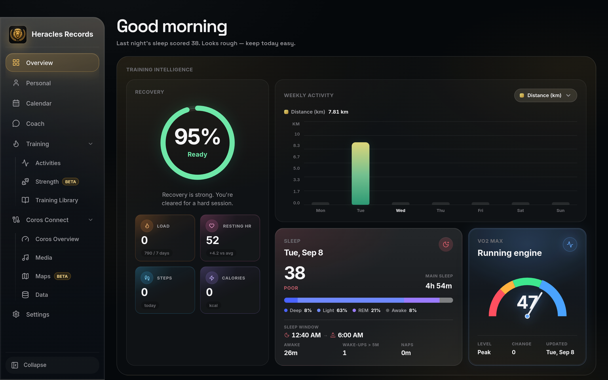
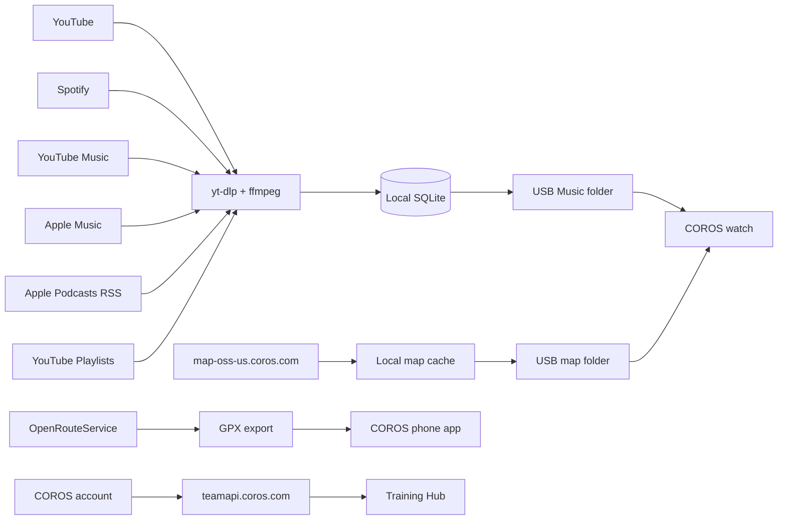

<p align="center">
  
</p>

<h1 align="center">CorosLink</h1>

<p align="center">
  <em>Your COROS watch companion — media, maps, and training analytics on desktop.</em>
</p>

<p align="center">
  <strong>Live site:</strong> <a href="https://coroslink.com/">coroslink.com</a>
</p>

<p align="center">
  <strong>Documentation:</strong> <a href="https://docs.coroslink.com/">doc.coroslink.com</a>
</p>

<p align="center">
  <a href="https://www.buymeacoffee.com/addridoa">
    
  </a>
</p>

<p align="center">
  Unofficial desktop app for COROS watch owners. Not affiliated with or endorsed by COROS.
</p>

<p align="center">
  
  
  
  
  
</p>

<p align="center">
  
</p>

---

## Overview

CorosLink brings music management, watch maps, route planning, and training analytics together for your **COROS watch**. Connect over USB to sync MP3s and map packages, download music from YouTube, Spotify, YouTube Music, or Apple Music playlists, download public Apple Podcasts episodes, build GPX routes on your desktop, and explore your training data in a rich dashboard — all from your Mac, PC, or Linux machine.

---

## Features

### Overview — Dashboard at a glance

Your home screen for watch status, library metrics, and quick actions. See everything about your connected COROS watch in one place.

- **Watch-aware dashboard** — detects your connected COROS watch and shows model-specific storage capacity
- **Time-of-day greeting** with a watch hero image and live connection status
- **Storage ring** showing used space, free space, and total capacity for your model (4 GB or 32 GB)
- **Visit heatmap globe** — activity visit density on a 3D globe, with street-level heatmap drill-down
- **Metric tiles** for local library count, tracks on watch, transferred count, and library size
- **Quick actions** to jump into YouTube browsing, playlist sync, or Spotify sync
- **Paste-a-link download** with optional auto-transfer to your watch
- **Recent downloads** with per-track transfer and delete actions

<p align="center">
  
</p>

---

### Media — Music manager

Download, organize, and sync MP3s to your watch. Multiple integrated workflows cover every way you add music.

#### Library

Your local MP3 collection, ready to transfer.

- **Full library table** with title, size, date, and watch sync status
- **Transfer single tracks** or **transfer all** pending downloads at once
- **Multi-select bulk delete** to clean up your local library
- **Watch storage meter** showing how much of the watch's capacity is in use
- **Live sync state** between the two panels — connected, syncing, pending, or
  all synced

<p align="center">
  
</p>

#### YouTube

Browse YouTube inside the app and download MP3s without leaving the page.

- **Embedded YouTube browser** with back, forward, home, and search
- **Green MP3 buttons** injected on video thumbnails for one-tap downloads
- **Playlist download** support on watch and playlist pages
- **Background download queue** with live progress — keep browsing while tracks download

<p align="center">
  
</p>

#### Spotify

Sync your Spotify playlists to MP3s and your watch.

- **OAuth login** with your own Spotify Developer app credentials
- **Browse owned and collaborative playlists** with sync status
- **Auto-match tracks** via YouTube search (`<artist> <track> official audio`)
- **Optional auto-transfer** to your watch when connected over USB

<p align="center">
  
</p>

#### YouTube Playlists

Sync your YouTube channel playlists with Google OAuth.

- **Google OAuth login** with your own Google Cloud OAuth credentials
- **Browse your playlists** and queue individual tracks for download
- **Background download queue** with live progress

#### YouTube Music

Sync your YouTube Music library playlists and liked songs.

- **In-app sign-in** — connect from CorosLink with automatic header capture (manual DevTools paste still available as a fallback)
- **Sync playlists and liked songs** from your library
- **Queue tracks** to download and transfer to your watch
- Requires **Python 3.10+** and **`ytmusicapi`** (`python3 -m pip install ytmusicapi`)

#### Apple Music

Browse your Apple Music library playlists and queue tracks for download.

- **In-app sign-in** — connect from CorosLink with automatic `amp-api` header capture (manual DevTools paste still available as a fallback)
- **Library playlists** load when library access is available from the captured session
- **Tracks resolve via YouTube search** — Apple Music streams are DRM-protected, so downloads use the same YouTube matching flow as Spotify sync

#### Apple Podcasts

Find a show from the public Apple Podcasts catalogue or paste its Apple Podcasts link, then download individual public RSS episodes directly as MP3s.

- **No sign-in required** — public show metadata and RSS feeds load directly
- **Progressive episode browsing** — load the latest 50 downloadable RSS enclosures first, then append older episodes as needed
- **Direct audio downloads** — episode audio goes through the existing queue and converts to MP3 for your watch
- **Subscriber-only and feedless episodes are excluded** — CorosLink only downloads publicly available RSS audio

---

### Maps — Watch maps and routes (BETA)

Download official COROS map regions and build custom GPX routes from your desktop.

#### Official map packages

Browse, cache, and install COROS map data to your watch over USB.

- **Browse official map regions** (Landscape and Topo) from the COROS v5 manifest
- **Search and filter** regions; download and cache packages locally
- **Watch storage panel** — maps vs other usage and free space at a glance
- **Install to watch** over USB with live copy progress
- **Choose a local map folder** for cached packages on your computer

<p align="center">
  
</p>

#### Route builder

Generate GPX routes and send them to your phone for import into the COROS app.

- **Generate loop or point-to-point routes** with an OpenRouteService API key
- **Import GPX files** from Strava, Komoot, or anywhere else — loaded as saved routes with distance, elevation, and loop detection
- **Sport presets** — running, walking, hiking, road cycling, and mountain biking — plus elevation preference
- **Interactive map preview** with start pin, fit route, and layer themes
- **Route stats** — distance, estimated time and pace, ascent/descent, and elevation profile
- **Export GPX** and **Share to phone** (QR) for import into the COROS mobile app's route library

Direct cloud upload to your COROS account is not wired yet; GPX export via the phone app is the supported path today.

<p align="center">
  
</p>

---

### Watch Faces — official iPhone hand-off (EXPERIMENTAL)

Publish an existing, valid COROS custom-watchface template archive from desktop,
then claim it through COROS's official share page on iPhone.

- **Template creator** — compose a background with colors and optional artwork;
  CorosLink builds a fresh archive while retaining the template's
  live time, date, battery, and complication controls
- **Digit & theme studio** — re-render the template's bitmap-font digit sprites
  in a locally installed font and color, and recolor weekday labels, battery
  digits, and metric icons; every resolution and the always-on-display tree is
  regenerated (AOD sprites are auto-dimmed) at the template's exact pixel sizes
- **Live sprite preview** — the on-screen face is composited from the same
  sprite bitmaps and `config.txt` layout the watch itself will render
- **Independent time styling** — resize and recolor hour and minute bitmap
  sprites separately while keeping each two-digit group centered
- **Draggable static separators (experimental)** — replace the template-anchored
  time colon and date slash with background-rendered separators that support
  exact X/Y, size, color, and direct preview dragging
- **Custom design sprites** — import up to twelve static PNG/JPEG/WebP layers,
  then drag, scale, rotate, position, and remove them before they are composited
  into the generated watchface background
- **Persistent watchface projects** — save the starter `.dat` together with
  artwork, custom sprites, component styles, separators, and layout offsets;
  reopen the project after restarting CorosLink and continue editing
- **Per-metric bitmap styling (experimental)** — give fixed heart-rate, steps,
  calorie, and elevation values their own color and 50–200% sprite scale;
  CorosLink generates an isolated ten-digit folder for each customized metric
- **Drag-to-move layout (experimental)** — position hours, minutes, weekday,
  month, day, battery, and metric elements independently; CorosLink rewrites the matching
  `config.txt` position keys for every resolution (scaled automatically)
- **Independent always-on studio** — switch to `AODconfig.txt` and edit its
  existing firmware layers, artwork, styles, effects, visibility, and placement
  without changing the current display; shared template sprites are isolated
  into AOD-owned folders during export
- **Live metric studio (experimental)** — activate fixed heart rate, steps,
  calories, and elevation fields when the source template exposes them; preview
  the selectable metric slot and drag every enabled field into place
- **Official source-template browser** — query COROS's editable-template
  catalog for the selected watch model, download the source ZIP, validate its
  manifest, and select it as the creator's starter in one step
- **3-pane watchface editor (beta)** — layer-based editor alongside the creator,
  with background canvas, local fonts, weather/temperature, and sprite tinting
- **Battery history & device info** — Bluetooth battery history and device
  details for a connected watch
- **Region-aware mobile login** — choose US / EU / CN so watchface publish works
  for accounts registered in those regions
- **Archive validation** — checks the ZIP/.dat package has `info.json`, a source
  template ID, DIY version, and a custom-face preview before upload
- **Separate mobile session** — signs in to the mobile COROS API; only the
  resulting session is kept in encrypted OS storage, never the password
- **Precision-safe publish flow** — preserves COROS's large template IDs exactly
  while creating the custom template and its time-limited share URL
- **QR hand-off** — scan the generated official COROS URL on the paired iPhone,
  save the face in COROS, then send it to the watch from the COROS app
- **Advanced tools** — legacy 614A carrier editor and raw `.bin` watchface
  installer for supported workflows

This is not a full bypass of the iPhone COROS app for normal publish hand-off.
Advanced raw install paths are experimental; endpoints are undocumented and may
change. Only upload or install archives you are entitled to use.

---

### Training Hub — COROS analytics dashboard

Log in with your COROS account to view training data, fitness scores, and race predictions — right on your desktop.

- **COROS account login** with email and password
- **Summary tiles** for Stamina, Recovery, Training Load, and Resting HR
- **Recovery readiness ring** with stamina overlay
- **7-day charts** for Training Load and HRV vs Baseline
- **EvoLab fitness scores** — Aerobic Endurance, Lactate Threshold, Anaerobic Endurance and Capacity
- **Race predictor** with estimated finish times by distance
- **Recent activities table** with a detail panel for laps, HR, elevation, and more
- **Strength activity detail** — set/rep summary and exercise table with resolved exercise names
- **Sleep & daily health** — sleep score/stages plus steps and calories from COROS data
- **FIT file export** via signed download URL
- **Bulk activity backup** — download your entire activity history (FIT, GPX, TCX, KML, or CSV) to a local folder; re-running only fetches new activities
- **Push activities to COROS** — import from intervals.icu or add manual activities

<p align="center">
  
</p>

---

### Strength — resistance training analytics

A dedicated view for lifting, built around a rotatable 3D muscle mannequin that
shades each muscle by how hard you have worked it.

- **Muscle map** — per-muscle set, volume, and time breakdowns on muscular and skeletal layers
- **Weekly trends** — weight lifted and sets side by side, with push/pull/legs/core balance
- **Exercise Explorer** — open any lift for every set, per-session PRs, best sets by rep range, estimated one-rep-max progression, and volume over time
- **Hevy sync** — connect a Hevy API key to merge Hevy workouts with your COROS strength history; sessions logged in both apps are de-duplicated, warmup sets are optional, and disconnecting erases the cached Hevy data
- **Metric or imperial** weights and volume, following the Settings unit switch

---

### Training Library — workouts, plans, templates, and adherence

A dedicated workspace for building and reusing training, from one structured
workout through a complete multi-week cycle.

- **Workout Library** — search, filter, sort, preview full steps, create with the
  sport-aware builder, edit with revision checks, duplicate, tag, collect,
  export, schedule, and safely delete COROS workouts; tiles draw each workout's
  step structure, its training load relative to the rest of the library, and
  when it was last scheduled, in the sport's own colour
- **Training Plans** — discover and cache native COROS plans, build local grouped
  plans, drag workouts across days and a holding area, add rest days and phases,
  duplicate/reorder/recovery weeks, shift start dates, and undo/redo changes
- **Templates** — reusable local plans and collections, including templates
  created from completed activities
- **Plan comparison** — compare two or three plans by duration, distance,
  training load, strength sets, sport/intensity mix, weekly progression, peak
  week, taper, shared workouts, and scheduling conflicts
- **Completed & adherence** — automatic confidence-scored calendar/activity
  matching, manual correction, skipped/missed/partial states, rescheduling, and
  planned-versus-completed metrics
- **Offline-aware sync** — cached data remains visible when one or more COROS
  reads fail, with explicit local/synced/pending/conflicted/failed/stale states

Native COROS plan discovery and detail reads are active. Native grouped-plan
writes remain visibly gated until the undocumented create/update/activation
contract can be verified without guessing; local templates and the existing
individual Workout Library/Calendar writes remain available.

---

### Calendar — scheduled workouts and activities

Month and week views for planned workouts and completed activities on one grid.

- **Drag-and-drop reschedule** for future workouts
- **Add / delete workouts** and week stats
- **Ask Coach** handoff from a selected day or week

---

### Coach — training chatbot

Ask training questions with answers grounded in your COROS data.

- **Providers** — ChatGPT (cloud), Claude via your subscription (Claude Code) or your own Anthropic API key, OpenRouter with your own API key, or local LLMs (Ollama / LM Studio)
- **Model selection & extended thinking** where the provider supports them
- **Multi-sport workout tools** — draft a single workout or adaptive multi-week plans across Run, Trail Run, Bike, Pool Swim, Strength, Indoor Climb, Bouldering, XC Ski, and HYROX, with COROS exercise catalog search for Strength and HYROX
- **Destination-aware confirmation** — choose Workout Library, Calendar, local template, COROS Plan Library, or Plan + Calendar; review weeks, workouts, sports, start date, conflicts, grouped-plan status, and every remote write before confirming
- **AI write guard** — Coach tool calls can draft workouts and plans but cannot upload them; the athlete must use the confirmation card
- **Follow-up questions** — Coach asks one clarifying question at a time with tappable answers instead of guessing; typing an answer still works
- **Chat history** — per-provider conversations persist across restarts

---

## How it works

CorosLink uses independent data paths — USB for watch files, OpenRouteService for routes, and COROS APIs for training.



**Music sync** does not use an official COROS SDK. The app detects your watch when it mounts as a USB drive with a `Music` folder, then copies MP3 files directly.

**Map install** downloads official packages from COROS map servers, caches them locally, and copies them to your watch's map folder over USB.

**Route builder** calls OpenRouteService to generate a route, then exports GPX for import through the COROS phone app (Bluetooth sync to the watch).

**Training Hub** authenticates with COROS team APIs to fetch your analytics, activities, and fitness scores. Credentials are sent to COROS servers at login; all other app data stays on your machine.

---

## Install

### Download

Get the latest installer from **[GitHub Releases](https://github.com/JunAkerBuilds/CorosLink/releases)**:

| Platform              | File                          |
| --------------------- | ----------------------------- |
| macOS (Apple Silicon) | `CorosLink-*-arm64.dmg`       |
| macOS (Intel)         | `CorosLink-*-x64.dmg`         |
| Windows               | `CorosLink Setup *.exe`       |
| Linux (x64)           | `CorosLink-*-x86_64.AppImage` |

Open the DMG, then drag **CorosLink** into **Applications** when the installer window appears. If Finder only shows a plain folder, drag `CorosLink.app` into Applications manually.

#### macOS: “app is damaged” or won’t open

Release DMGs from GitHub are **signed and notarized**. If Gatekeeper still blocks an older or locally built unsigned copy, clear the quarantine flag after installing:

```sh
xattr -cr "/Applications/CorosLink.app"
```

Then open normally. If that still fails, right-click the app → **Open** → **Open** again.

Windows may show a SmartScreen prompt for unsigned installers — click **More info** → **Run anyway**.

On Linux, download the AppImage, mark it executable (`chmod +x CorosLink-*.AppImage`), then run it. Most desktop environments can also open AppImages directly from the file manager.

### In-app updates

Packaged builds check **[GitHub Releases](https://github.com/JunAkerBuilds/CorosLink/releases)** for new versions on launch. When an update is available, CorosLink downloads it in the background and shows **Restart to update** in the header. You can also click the version badge to check manually.

> **First release with in-app updates:** Users on v0.1.7 or earlier must install manually once. After that, updates arrive in-app. Signed macOS builds (v0.1.16+) support reliable in-app update install.

### Build from source

```sh
git clone https://github.com/JunAkerBuilds/CorosLink.git
cd CorosLink
npm install
npm run rebuild
npm run dist:mac    # macOS DMG (run on macOS)
npm run dist:win    # Windows NSIS installer (run on Windows)
npm run dist:linux  # Linux AppImage (run on Linux)
```

Installers are written to `release/`.

### Requirements

- **macOS**, **Windows**, or **Linux**
- **USB cable** to connect your COROS watch for music and map sync
- **yt-dlp** and **ffmpeg** — bundled in packaged builds; falls back to `PATH` if missing
- **OpenRouteService API key** (optional) — only needed for Route Builder
- **OpenRouter API key** (optional) — only needed when OpenRouter is selected for Coach compute
- **Spotify Developer app** (optional) — only needed for Spotify playlist sync
- **Google Cloud OAuth app** (optional) — only needed for YouTube Playlists sync
- **Python 3.10+** and **ytmusicapi** (optional) — only needed for YouTube Music library sync
- **COROS account** (optional) — only needed for Training Hub

---

## Privacy and data

- **Music and downloads** — stored locally in the Electron user data directory (SQLite database + MP3 files on disk)
- **Spotify tokens** — stored locally in SQLite after OAuth; never sent anywhere except Spotify
- **Google OAuth tokens** — stored locally in SQLite after OAuth; used only for YouTube Data API playlist reads
- **YouTube Music / Apple Music headers** — stored locally and used only to read your library metadata; never sent to CorosLink servers
- **Apple Podcasts** — public catalogue searches and RSS feeds are requested directly to discover publicly downloadable episodes; no account credentials are collected
- **Map cache** — downloaded map packages are stored in a local folder you choose; copied to the watch over USB only
- **OpenRouteService** — route requests are sent to OpenRouteService when you generate a route (your API key is stored locally)
- **OpenRouter** — when selected for Coach, coaching prompts and requested COROS tool data are sent through OpenRouter to the model you choose; the API key is encrypted in local app storage
- **Training Hub** — your COROS email and password are used to authenticate with COROS servers. Activity data is fetched on demand and not synced to any third-party service
- **No cloud sync** — the app does not run its own backend or upload your files

> Only download media you have the rights or permission to download.

---

## Development

<details>
<summary><strong>Development setup</strong></summary>

```sh
npm install
npm run rebuild
npm run binaries:prepare
npm run dev
```

The dev command starts Vite at `http://127.0.0.1:5173/` and launches Electron. `npm run rebuild` prepares native SQLite bindings for Electron. `npm run dev` automatically runs `binaries:prepare` before Electron starts, downloading the pinned `yt-dlp` release and copying the `ffmpeg-static` binary into `bin/<platform>-<arch>/`. You can also run `binaries:prepare` manually if you only need to refresh media tools.

To prepare Windows x64 media binaries from any platform:

```sh
npm run binaries:prepare:win
```

To prepare Linux x64 media binaries from any platform:

```sh
npm run binaries:prepare:linux
```

To prepare both macOS architectures (Apple Silicon and Intel) from any platform:

```sh
npm run binaries:prepare:mac
```

For hardware-free watch detection checks, set `COROS_WATCH_PATH=/path/to/mock-watch` with a `Music` folder, or run:

```sh
npm run smoke:watch
```

To regenerate README screenshots:

```sh
npm run build:electron
./node_modules/.bin/electron scripts/capture-readme-screenshots.cjs
```

</details>

<details>
<summary><strong>Spotify Developer setup</strong></summary>

Create a free Spotify app in the [Spotify Developer Dashboard](https://developer.spotify.com/dashboard), then add this redirect URI exactly:

```text
https://127.0.0.1:4567/callback
```

Paste the app's Client ID and Client Secret into the Spotify Sync view. The app opens a local OAuth login window and stores the resulting token locally in SQLite.

Playlist sync reads the authenticated user's playlists and only enables playlists that Spotify allows the user to read — currently playlists the user owns or collaborates on. Each track is searched on YouTube as `<artist> <track> official audio`, downloaded as an MP3, and saved as `Artist - Track Name.mp3`.

</details>

<details>
<summary><strong>YouTube Playlists setup</strong></summary>

Create an OAuth 2.0 Client ID in the [Google Cloud Console](https://console.cloud.google.com/apis/credentials) (Desktop app or Web application), enable the **YouTube Data API v3**, then add this redirect URI exactly:

```text
http://127.0.0.1:4568
```

Paste the Client ID and Client Secret into the YouTube Playlists view, then connect. The app opens a local OAuth login window and stores tokens locally in SQLite.

</details>

<details>
<summary><strong>YouTube Music setup</strong></summary>

Install Python 3.10+ and ytmusicapi:

```sh
python3 -m pip install ytmusicapi
```

Open [music.youtube.com](https://music.youtube.com/library) while signed in, open DevTools (F12), go to the **Network** tab, filter for `browse`, right-click a **POST** request, and choose **Copy → Copy as cURL**. Paste the command into CorosLink and connect. Headers must include `cookie` and `x-goog-authuser`. They expire when you sign out of YouTube Music in your browser — re-paste if syncing stops.

</details>

<details>
<summary><strong>Apple Music setup</strong></summary>

Open [music.apple.com](https://music.apple.com) while signed in, open DevTools (F12), go to the **Network** tab, filter for `amp-api`, right-click any request, and choose **Copy → Copy as cURL**. Paste into CorosLink and connect. The `authorization` bearer token is required; include `media-user-token` for personal library playlists. Tokens expire often — re-paste if fetching stops working.

Apple Music streams are DRM-protected. CorosLink reads playlist metadata from Apple and resolves each track via YouTube search for download (same approach as Spotify sync).

</details>

<details>
<summary><strong>Packaging</strong></summary>

```sh
npm run dist
```

Before packaging, run `npm run binaries:prepare`. The packaged app checks bundled binaries first, then falls back to `PATH`.

Convenience target scripts:

```sh
npm run dist:mac
npm run dist:win
npm run dist:linux
```

For a quick local packaging layout check without code signing:

```sh
CSC_IDENTITY_AUTO_DISCOVERY=false npm run dist -- --dir
```

Because `better-sqlite3` is native, build Windows installers on Windows or in CI where Electron native dependencies can be rebuilt for the Windows target. The same applies to Linux AppImages on Linux.

**Publishing a release (maintainers):**

1. Prepare the version in `package.json` and `package-lock.json` so they match the tag you are about to create:

```sh
npm run release:prepare -- v0.1.18
git commit -am "chore: release v0.1.18"
git tag v0.1.18
git push origin main v0.1.18
```

2. That triggers the [Release installers](.github/workflows/release.yml) workflow. CI syncs the tag into `package.json` before building, then verifies the versions match, so installer names like `CorosLink-0.1.18-arm64.dmg` and `CorosLink-0.1.18-x64.dmg` always follow the git tag. The workflow also uploads `latest-mac.yml`, `latest-linux.yml`, and `latest.yml` plus macOS/Windows blockmaps so packaged apps can auto-update via `electron-updater` (Linux AppImage embeds its blockmap in the file). Each platform build runs `scripts/verify-release-artifacts.mjs` and fails if update metadata is missing.

You can also run the workflow manually from **Actions → Release installers** (it uses the current `package.json` version when no tag is pushed).

Pushes to `main` run [Build desktop installers](.github/workflows/build.yml) and upload CI artifacts for testing before tagging.

**Verify release artifacts locally:**

```sh
npm run dist:mac    # or dist:win / dist:linux on the matching OS
npm run release:verify-artifacts -- macos
```

After building, confirm `release/latest-mac.yml` (or `latest.yml` / `latest-linux.yml`) exists and that the packaged app contains `app-update.yml` with the GitHub publish config.

**Test auto-update end-to-end (maintainers):**

1. Tag and ship a baseline release that includes the updater (e.g. v0.1.8).
2. Install that build from GitHub Releases on a test machine.
3. Confirm the header shows a clickable version badge (not dev-only text).
4. Tag and ship a newer release (e.g. v0.1.9).
5. In the older app, wait ~5 seconds or click the version badge.
6. Expect: checking → update available → downloading → **Restart to update**.
7. Click restart; the app should relaunch on the new version.

**Windows** and **signed macOS** builds should complete this flow. Locally built unsigned macOS apps may still need a manual download from GitHub Releases.

</details>

---

<p align="center">
  Built with Electron, React, and Vite · CorosLink Contributors
</p>
