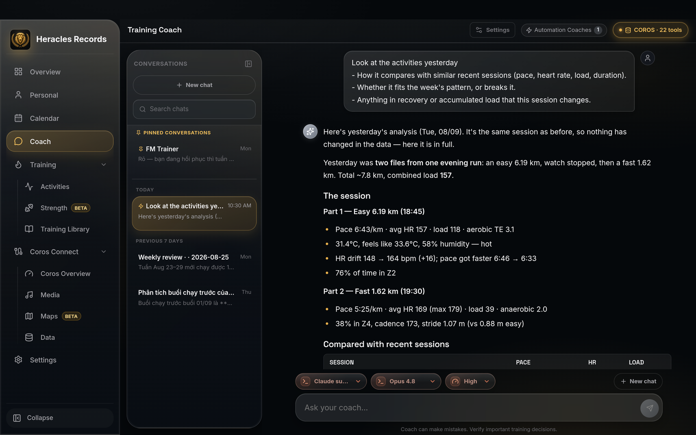
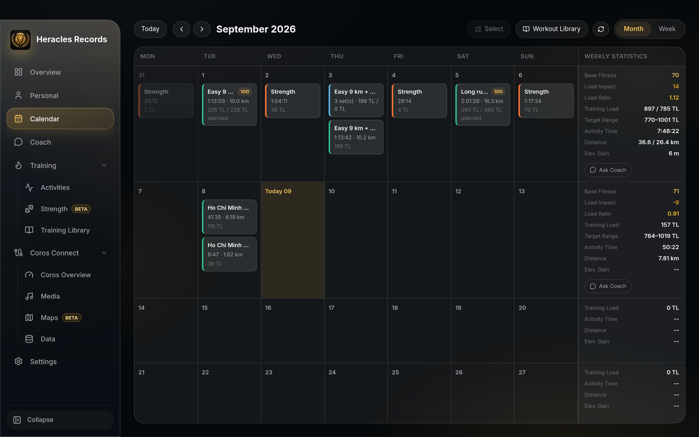
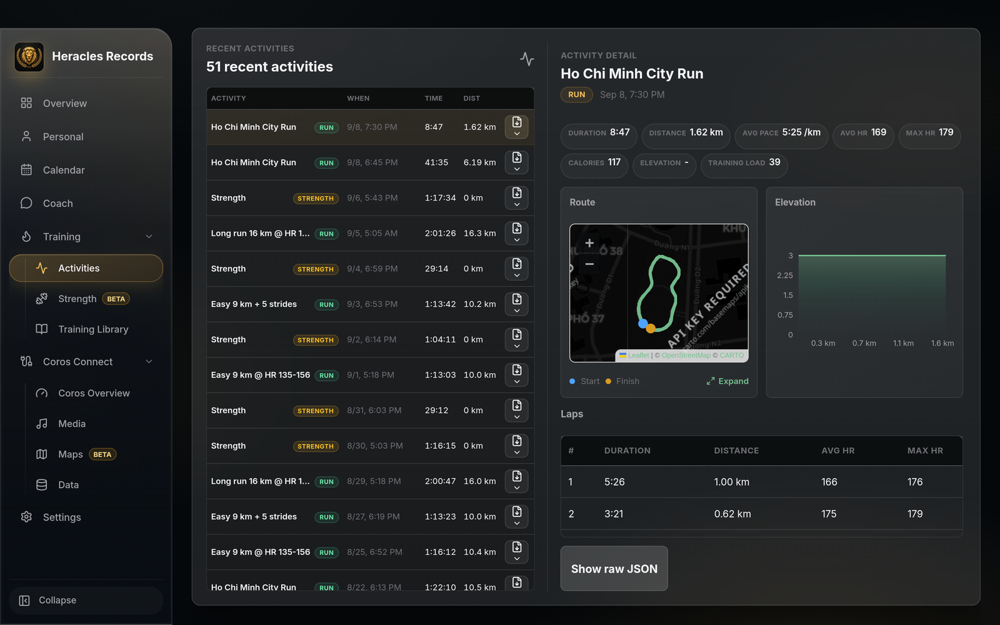
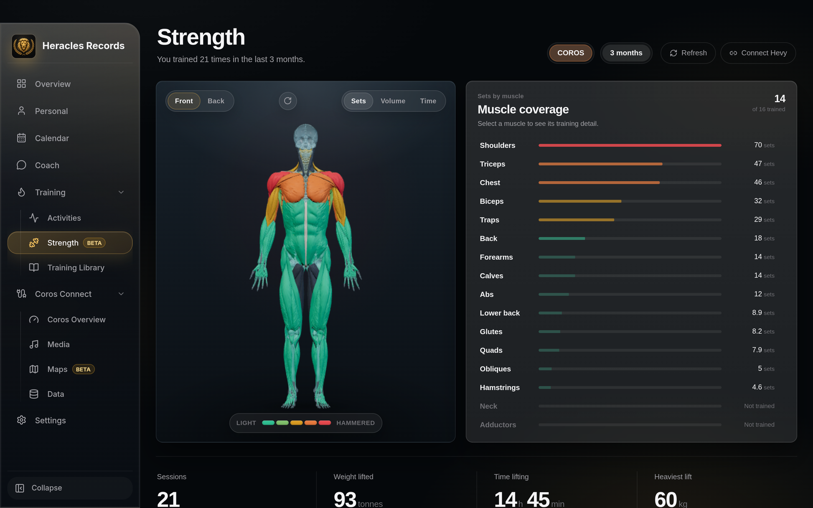
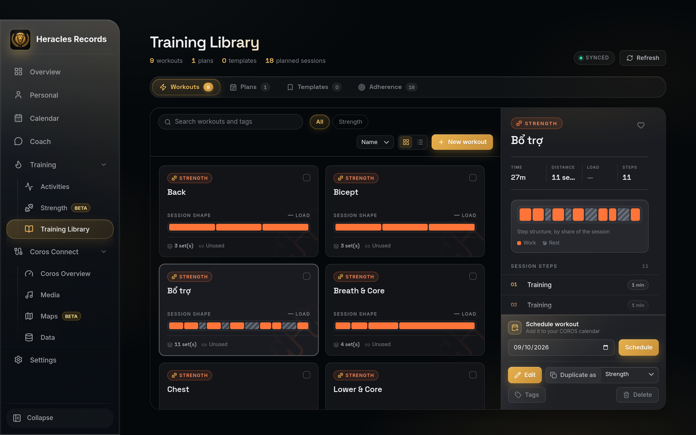
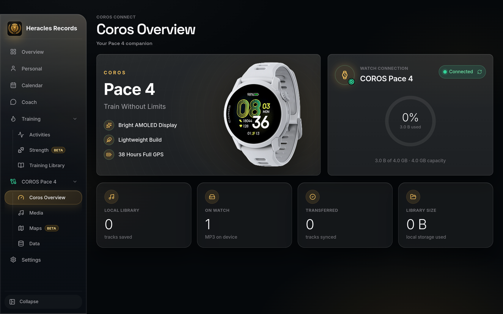

<p align="center">
  
</p>

<h1 align="center">Heracles Records</h1>

<p align="center">
  <em>Your training log and your AI coach, on your own machine.</em>
</p>

<p align="center">
  
  
  
  
</p>

<p align="center">
  
</p>

---

## What it is

A desktop app that keeps one honest record of your training — every session, every plan,
every night of sleep — and puts a coach next to it that has actually read all of it.

Everything lives in a SQLite file on your machine. The only thing that leaves is what you
send to your chosen AI provider, and what a COROS sign-in needs.

It also talks to a COROS watch over USB — music and maps. That part is a convenience, not
the point.

---

## Features

### Coach — an AI that has read your whole log

Chat with Claude, an OpenRouter model, or a local model. The coach reads your activities,
analytics, plans and calendar through built-in tools, so "why did that long run fall apart?"
gets an answer from your data instead of a guess.

- **Four providers** — Claude subscription, Anthropic API, OpenRouter, or a local model
- **A built-in COROS toolset** — activities, analytics, workouts, calendar — plus any MCP server you add
- **Automations** — scheduled, headless coach runs that leave drafts as approval cards;
  auto runs are read-only by design
- **Effort and model switches** per conversation, with pinned and searchable history

<p align="center">
  
</p>

### Overview — where you stand today

Recovery, load, resting HR, sleep and VO₂ max on one screen, with a greeting that reads the
numbers before you do.

### Calendar — plan against what happened

Planned workouts and completed activities side by side, with weekly base fitness, load ratio
and target range. Drag to reschedule; ask the coach about any week without leaving the grid.

<p align="center">
  
</p>

### Activities — every session in detail

Route, elevation, laps, HR and training load per activity, over your full history — with the
raw record one click away.

<p align="center">
  
</p>

### Strength — what you actually trained

COROS strength sessions merged with Hevy imports, mapped onto a 3D model so a neglected
muscle group is impossible to miss.

<p align="center">
  
</p>

### Training Library — workouts, plans, adherence

Build workouts and plans, schedule them to your COROS calendar, and see how closely each
completed session matched what was planned.

<p align="center">
  
</p>

### Personal

The identity, body metrics and training thresholds your COROS account holds — max HR, LTHR,
threshold pace, FTP — and the zones derived from them.

### Sync and backup

Two machines, one COROS account, the same data. Sync runs continuously to a local folder or
Google Drive; backup is a single file you save where you like and restore when you want it.

**No credential ever leaves the machine, on either path.**

---

## COROS Connect

Secondary features for people who own a COROS watch. Connect over USB:

| | |
|---|---|
| **Media** | Download MP3s from YouTube, Spotify, YouTube Music, Apple Music or Apple Podcasts and copy them to the watch |
| **Maps** | Install official COROS map packages; build routes with OpenRouteService and export GPX |
| **Data** | Browse the raw records the app holds |

<p align="center">
  
</p>

> Unofficial. Not affiliated with or endorsed by COROS.
> Only download media you have the rights to.

---

## Install

Grab an installer from [Releases](https://github.com/quochungse/HeraclesRecords/releases):

| Platform | File |
|---|---|
| macOS (Apple Silicon) | `HeraclesRecords-*-arm64.dmg` |
| macOS (Intel) | `HeraclesRecords-*-x64.dmg` |
| Windows | `HeraclesRecords-Setup-*.exe` |
| Linux (x64) | `HeraclesRecords-*.AppImage` |

Packaged builds check for updates on launch and install them in place.

**macOS**, if Gatekeeper blocks an unsigned local build:

```sh
xattr -cr "/Applications/Heracles Records.app"
```

**Linux**: `chmod +x HeraclesRecords-*.AppImage`, then run it.

### Build from source

```sh
git clone https://github.com/quochungse/HeraclesRecords.git
cd HeraclesRecords
npm install
npm run rebuild            # native SQLite bindings for Electron's ABI
npm run binaries:prepare   # yt-dlp + ffmpeg into bin/
npm run dev                # Vite on 127.0.0.1:5173 + Electron
```

`npm run dist:mac` / `dist:win` / `dist:linux` write installers to `release/`. Build each
platform on that platform — `better-sqlite3` is native.

### What you need

Nothing but the app to start. Everything else is optional and only for the feature it serves:

- **COROS account** — activities, analytics, plans, calendar
- **An AI provider** — Claude subscription, Anthropic key, OpenRouter key, or a local model
- **USB cable** — music and maps on the watch
- **OpenRouteService key** — route generation
- **Spotify / Google OAuth apps, Apple Music headers, `ytmusicapi`** — the matching media source

---

## Privacy

- **Your training data stays on this machine** — SQLite in the Electron user data directory
- **Coach prompts** go only to the provider you pick, with the tool data that answers them
- **COROS credentials** are sent to COROS to sign in, and nowhere else
- **Sync and backup carry user data only** — no token, key or account sign-in travels, down any path
- **No backend.** The app uploads nothing to us; there is no us

---

## Development

<details>
<summary><strong>Commands and layout</strong></summary>

```sh
npm run build        # tsc electron + tsc --noEmit renderer + vite build  (the only typecheck)
npm start            # build, then run the packaged-style app
npm run smoke:watch  # hardware-free watch detection
```

There is no linter and no test runner. Tests are ~91 standalone `scripts/test-*.mjs` files,
each wired to its own npm script — `npm run test:chat-service`, `npm run test:ipc-surface`,
and so on. `npm run | grep test:` lists them.

Three layers: `src/` is a React 19 + Vite renderer, `electron/preload.ts` bridges ~254 IPC
channels, and `electron/*Service.ts` does the work with `electron/database.ts` owning SQLite.
Adding a channel means editing `main.ts`, `preload.ts` and `src/coroslink-api.ts` together,
then running `npm run test:ipc-surface`.

See [CLAUDE.md](CLAUDE.md) for the architecture in full, and [docs/](docs/) for the
feature-level notes.

</details>

<details>
<summary><strong>Optional integrations</strong></summary>

**Spotify** — create an app in the [Spotify Developer Dashboard](https://developer.spotify.com/dashboard),
add the redirect URI `https://127.0.0.1:4567/callback`, paste the Client ID and Secret into
the Spotify Sync view.

**YouTube Playlists** — create an OAuth 2.0 Client ID in the
[Google Cloud Console](https://console.cloud.google.com/apis/credentials), enable the YouTube
Data API v3, add the redirect URI `http://127.0.0.1:4568`.

**YouTube Music** — `python3 -m pip install ytmusicapi`, then copy a `browse` POST request
from [music.youtube.com](https://music.youtube.com/library) as cURL and paste it in.

**Apple Music** — copy any `amp-api` request from [music.apple.com](https://music.apple.com)
as cURL and paste it in. Streams are DRM-protected, so tracks are resolved via YouTube.

**Google Drive sync** — a packaged build needs `HERACLES_GOOGLE_OAUTH_ID` and
`HERACLES_GOOGLE_OAUTH_KEY` at build time, or the Drive option stays disabled.

</details>

<details>
<summary><strong>Releasing</strong></summary>

```sh
npm run release:prepare -- v1.0.1   # syncs package.json + lockfile, prints the commands
git commit -am "chore: release v1.0.1"
git tag v1.0.1
git push origin main v1.0.1
```

The tag push triggers `release.yml`, which re-checks that the tag and `package.json` agree,
builds every platform, and gates on `verify-release-artifacts.mjs` for updater metadata.

</details>

---

<p align="center">
  Built with Electron, React and Vite · <a href="LICENSE">MIT</a>
</p>
